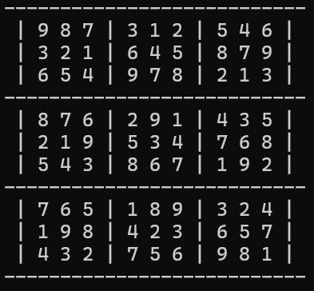

# Sudoku Generator and Solver
## Overview
The **sudoku.py** file generates a valid sudoku grid on every run, shuffles it and removes the desired number of elements from the grid to generate a puzzle to solve. The solve_sudoku method is called recursively to solve the puzzle and check if the entire grid has been filled!
##

## Detailed description of each method
Firstly, all the methods are part of the **Sudoku** class to ensure maintainability and for readability.

In all the explanations, I am going to refer to indices starting from 0 instead of 1. 
Before generating any sudoku grids, I researched about the maths behind the generation and how the different constraints are taken into account. There are several ways of generating sudoku puzzles. One way is to randomly fill a cell and then maintain a list of all the valid numbers that can be entered in the box of that cell and in the row and column of that cell. E.g., if you filled 1 in the first row's third column, this would mean you cannot fill 1 in the 3x3 grid where 1 is placed as well as the first row and third column too. You would follow this approach iteratively keeping track of all the possibilities for each cell in the grid as each number is placed without violating the rules of the puzzle. Another approach is to choose random positions in each row and start filling out numbers from 1-9 in ascending order. E.g., in the first row you start filling the numbers 1-9 from column one and in the second row you start the numbers from 1 at column 3 and the remaining numbers are placed towards the front of 1. Likewise, you would fill the numbers for the rest of the rows. This would ensure that all the rules are maintained. I chose this approach while generating my sudoku grids and this is where the `shift(self, given_list, n)` is used. 

1. `shift(self, given_list, n)`
This method takes a list of numbers and shifts it to the right by **n** indices. E.g., if you have a list [1, 2, 3, 4, 5, 6, 7, 8, 9] and n=3 then this would place modify the list like this: [7, 8, 9, 1, 2, 3, 4, 5, 6].

2. `fill_grid(self, grid, indices)`
This method takes an list initialised with 0's and a list of indices which stores the amount to shift each row by. For each row in the grid, we shift the list of numbers 1-9 by the index in the **indices** list given in the method's argument. This will generate the same grid everytime but ensure that it follows all the rules of the puzzle. 

3. `print_grid(self, grid)`
This method just takes a list of numbers and formats it as a sudoku grid with 9 3x3 boxes printed to the terminal with borders. 

4. `extract_column(self, grid, col_number)`
This method takes a list of numbers (**grid**) and a column number and then extracts all the elements in that column and returns them to us.

5. `assign_column(self, grid, col, col_data)`
This method takes a list of numbers (**grid**) and a column (**col**) to shift another column's data which is a list. It loops through the entire grid and inserts the list elements at the required column and returns the final grid to us. 

6. `shuffle_columns(self, grid, col1, col2, col3)`
This method takes a list of numbers and 3 columns to shuffle. These columns can only be 0, 1, 2, or 3, 4, 5 or 6, 7, 8 as they maintain the constraints. One thing that could have been improved is to include checks inside the method to ensure a valid combination of column numbers were provided. This method stores a dictionary with each column number as the key and their data as the value. We then make a copy of the column indices list and shuffle it. Then in the for loop we take the first element of the shuffled list and copy the first column of the original list to that first column of the shuffled list. We do this for the rest of the columns and return the list with the shuffled columns. 

7. `extract_row(self, grid, row_number)`, `assign_rows(self, grid, row, row_data)` and `shuffle_rows(self, grid, row1, row2, row3)` work in a similar fashion to the above 3 methods. 

8. `shuffle(self, filled_grid)`
This method was created for maintainability so that the multiple calls to shuffle the columns and rows can be managed easily. The motive behind the helper methods for shuffling rows and columns as well as the shuffling methods themselves was to ensure the numbers were placed in different positions everytime whilst maintaing the rules of the puzzle. This helped to generate different grids everytime the method was called.

9. `remove_digits(self, grid, n)`
This method takes the shuffled grid as a list and an input **n** numbers to remove from the fully generated list. The method iterates through the entire list and fills **n** 0s at random positions avoiding duplicates.

10. `is_valid(self, grid, num, index)`
This is a very crucial method which checks whether a given number **num** is valid when positioned at **index** in the grid. It checks for validity within the row of that number using **index** as well as column and box. One crucial step was to add the condition for index in the row/column/box not being equal to the current index. This made sure that we weren't checking the current index we are testing. We only need to check the rest of the row/column/box to see if the number is already present. If we didn't add the check, this would say that the **num** is already present in that row/column/box when we are only testing it and it would incorrectly return False. 

11. `find_empty(self, grid)`
Thsi method loops through the entire list and finds the next 0. If no 0s are present, the entire grid has been solved so None is returned. Otherwise, the index of the next 0 is returned. 

12. `solve_sudoku(self, grid)`
This method first retrieves the next empty cell (filled with 0) in the grid. If none are returned, it returns True and declares that the puzzle has been solved. Else, it calculates the respective row and column of that position of the empty cell. Then we loop through the list of numbers from 1-9 to try and see which number can be inserted into that cell. We call the **is_valid** method and if it returns True then we place the empty cell with that number. Then we call the **solve_sudoku** method recursively to check if the puzzle has been solved. If the **is_valid** method returns False, we replace the empty cell's index with 0 again and backtrack and move to the next number to try and see if it is valid for that cell. 

13. `main()`
This is the method which makes the calls to all the methods and prints relevant statements to the terminal before method call.